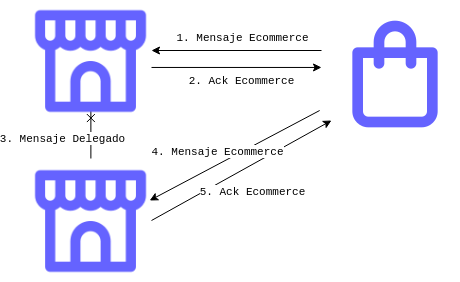

# Informe
Este trabajo fue realizado en el marco de la materia Técnicas de Programación Concurrente, de la Facultad de Ingenieria, por los alumnos:
* Camila Ayala
* Julian Gonzalez Calderón
* Noah Masri

## Para correr un local:

```bash
cargo run --bin local <ID>
```

Donde ID es el identificador del local,
un numero entre 0 y MAX_LOCALES el cual se puede configurar en ``src/lib.rs``
El local ejecutara localmente los pedidos del archivo `config/pedidos{ID}`.


## Para correr un ecommerce:

```bash
cargo run --bin ecommerce <archivo de pedidos>
```

## Para correr a Dios:
### Para matar a un local

```bash
cargo run --bin asesino -- --id <ID> -k
```

### Para revivirlo:

```bash
cargo run --bin asesino -- --id <ID>
```

Donde ID es el identificador del local.

# Decisiones de diseño

## Supuestos realizados
Tomamos como hipótesis que solo tendremos hasta 65536 ids de pedido, es decir, solo tendremos hasta 65536 numeros de productos distintos en un local, por lo que declaramos el id de un producto como u16, esperando que de todas formas nunca se usen todos. Además, no seremos una tienda mayorista, por lo que tampoco permitiremos que se hagan pedidos por una cantidad mayor a 256.

## Local
La primera entidad modelada es el local. Cada uno de estos cuenta con un stock, y un archivo de pedidos que modelan los pedidos que realizan los clientes que ingresan al local fisico. Ademas, acepta pedidos de los ecommerces, procesandolos en caso de ser posible, y delegandolos al siguiente local en caso de no contar con los recursos suficientes.

### Guardian
Esta estructura maneja el acceso y modificacion del stock de un local. Como concurrentemente se procesan pedidos locales y de ecommerce, el stock va a querer ser accedido por varios y para minimizar los problemas de sincronizacion se creo este actor llamado Guardian.
Tanto el empleado que procesa los pedidos locales, como el servidor ecommerce detallados a continuación cuentan con la direccion del guardian y se comunican con este cuando quieren ejercer cambios sobre el stock.

### Empleado
El empleado es el encargado de las ventas presenciales del local. Es un actor que recibe pedidos, y se encarga de comunicarse con el guardian, el cual le indicará a través de un nuevo mensaje el resultado del pedido. El guardian responde usando la direccion incluida en el mensaje que solicita modificar el stock, especificando a que pedido se refiere incluyendo el id proveido. Estos resultados son:

- Pedido exitoso.
- Sin suficiente stock, para cuando existe ese producto, pero no hay suficiente cantidad para satisfacer al cliente.
- Sin producto, para cuando no existe ninguna unidad de ese producto en el local.

En los siguientes diagramas se observa un resumen de la interaccion entre el empleado y el guardian. En el primero se observa lo que sucede cuando hay stock, mientras que el segundo muestra lo que pasa cuando no lo hay (ya sea porque no hay nada o porque no es suficiente). Ambos casos son muy similares.


### Servidor Ecommerce

Esta es la estructura encargada de resolver los pedidos de los ecommerces, incluyendo los que son delegados por otros servidores ecommerces de otros locales. Los pedidos son procesados leyendo de un socket y se crean tareas asincronicas por cada peticion recibida. Además, contiene la dirección del guardian para podes sincronizar el stock. A diferencia del local fisico, los pedidos pueden cancelarse. Es por esto que la comunicacion con el guardian consta de los siguientes mensajes:
- Bloquear: Se envia al procesar inicialmente el pedido, si falla esta operacion es porque no se cuenta con el stock necesario en el local, por lo que el pedido va a ser delegado. Se le asigna al stock bloqueado un id conformado por el id de pedido y el puerto del ecommmerce que lo genero.
- Confirmar: Se envia si el pedido fue retirado a tiempo. Se le informa al guardian el id del pedido para que deje de guardarlo en sus pendientes.
- Cancelar: Se envia si el pedido no fue retirado a tiempo. Se le informa al guardian el id del pedido para que deje de guardarlo en sus pendientes, y vuelva a dejar el stock disponible.

La delegacion a otros locales de un pedido ecommerce se lleva a cabo encapsulando el mensaje ecommerce en un mensaje delegado, donde se incluyen los campos adicionales que indican a que direccion mandar el resultado del pedido y una lista que lleva cuenta de que locales ya intentaron resolver este pedido. Si un local recibe un pedido delegado donde su id ya figura debe encargarse de comunicarle al ecommerce que nadie pudo resolver su pedido. Cada local tiene asignado un local mas cercano o siguiente, a quien delega. Cuando un servidor ecommerce recibe un mensaje de delegacion, debe enviar un ACK de este, y a su vez cuando envia uno debe esperar al ACK correspondiente a este. Esta espera, para evitar gastar recursos, se hizo mediante el uso de un monitor async.

Puede simularse la caida del internet. Para lograrlo, debe cerrarse el socket. Es por esto que se centraliza el envio de mensajes por el socket en un actor, descripto a continuacion, y la lectura al hilo principal. Cuando se cae la internet, se procede a escuchar de un socket qu es establecido especificamente para este proposito, donde se espera que llegue una señal donde, simulando que volvio el internet, se bindeara a un nuevo socket.
 
### Mensajero

El mensajero es un actor encargado de encapsular el envio de mensajes a traves del socket, esto permite poder simular el cierre del socket para todas las tareas que lo estan utilizando, y abrirlo nuevamente cuando se requiera. Los mensajes que sabe responder son:

- Enviar: Tiene una estructura similar al envio de mensajes a través de un socket UDP.
- Desconectar: Cierra el socket que esta siendo utilizado, devolviendo error a los siguientes pedidos de envío.
- Conectar: Establece un nuevo socket, permitiendo nuevamente pedidos de envío.

De esta forma, podemos mantener la estructura del servidor a lo largo de las desconexiones, unicamente interactuando con el mensajero.

## Ecommerce

Debido a la interración entre los locales, la lógica del ecommerce es bastante simple. Lee de un archivo de pedidos y los envía a un local aleatorio. Además, le agrega a cada pedido un identificador propio, el cual utilizará para recibir la respuesta. Para que los pedidos se puedan resolver concurrentemente, se utiliza un threadpool, creando una tarea por cada pedido.

Ademas del envio de pedidos, se tiene un hilo lector, el cual procesara los mensajes de respuesta de los locales, tanto los mensaje de ack como los mensaje de confirmacion. Si en un tiempo determinado, no se recibe la confirmación del pedido, entonces el ecommerce asume que se perdio y vuelve a realizar el pedido a otro local. Esto se debe a que los locales pueden perder conectividad en cualquier momento

## Interacciones entre procesos

### Protocolo de transporte
Para la interacción interproceso, se decidio hacer uso de UDP como protocolo de transporte. Esta eleccion se debe a que UDP no requiere el almacenamiento de estados de conexión, lo cual lo hace bastante escalable. A su vez, permite la utilización de un unico socket para la comunicación con múltiples direcciones, lo que ahorra muchos chequeos y permite una facil desconexion de los locales. Pensando en TCP, en caso de haberlo elegido, probablemente se debería haber tenido una conexión por cada par de locales, lo que nos daria un total de $\frac{n(n-1)}{2}\$ sockets abiertos, o en su defecto reestablecer una conexion cuando el local se desconecta y se vuelve a conectar, perdiendo tiempo en la realización del handshake.

El uso de UDP permite una comunicación más veloz, pero trae como consecuencia la necesidad del uso de ACKs, no solo por si se pierden los mensajes sino tambien para que se note la caída de la conexión.

### Comunicacion
Se eligio realizar una interaccion en forma de anillo, en donde un ecommerce envia un pedido a un local, y el local se encarga de la resolucion, delegandolo al siguiente local si no tiene stock, y enviando el aviso correspondiente si nota que nadie tiene stock.

La base de todo el protocolo es la estructura de pedido, que contiene el id del producto y la cantidad de producto a pedir:


Los mensajes enviados entre los procesos tendrán la siguiente estructura:


### Casos posibles

#### Secuencia rapida

El caso mas simple ocurre cuando el primer local tiene stock suficiente. La secuencia comienza con un ecommerce enviando un mensaje ecommerce a su tienda mas cercana.


Si se analiza internamente lo que sucede en todas las estructuras intervinientes, observaríamos las siguientes interacciones:


El mensaje ecommerce contiene el pedido, y un identificador


El ack simplemente contiene el identificador


Una vez se concreta el pedido, se envia un mensaje de confirmacion


#### Secuencia con delegacion

Si el primer local no tiene stock, debe delegarselo al siguiente local. Será este el encargado de comunicar el resultado.


El mensaje de delegación incluye al mensaje ecommerce, pero además contiene el puerto/identificador del ecommerce que creo el pedido, y una lista de locales que ya recibieron el mensaje (para detectar un bucle)


Debido a que los identificadores son propios de los ecommerces, necesitamos agregar de que ecommerce proviene un pedido, para identificarlo unequivocamente. Luego, el ack del mensaje delegado contendrá:


#### Secuencia sin stock

Si ninguno de los locales tiene stock, entonces se producirá un bucle. En cuanto un local lo detecta, debera informarle al ecommerce que no hay stock.


#### Secuencia con salteo

Si un local no recibe el ack de un mensaje delegado, deberá saltearlo y enviarle el pedido al siguiente.


#### Secuencia con salteo inicial

Si el ecommerce nunca recibe el ack del pedido, entonces deberá elegir otra tienda para enviarle el pedido.


#### Secuencia con reenvio

Si el ecommerce recibe el ack del pedido, pero el local pierde conectividad inmediatamente después, entonces descartará el pedido. El ecommerce detectará que nunca recibio la confirmación, y volvera a enviar el pedido a otro local.


